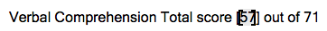
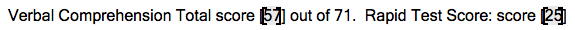

# Paragraphs

```json
{
  "type": "paragraph",
  ...
}
```

## field_dtype

- Default: `string` 

Due to the common assumption that paragraphs parse a piece of text, by default paragraph's will set the `field_dtype` to `string`.  This is a design decision in order to save space in needless declarations. 

!> If there is an inherited `field_dtype` from a parent element, then the paragraph will not override it.

## identifiers

- Type: `list`

A list of strings to match in order to identify a paragraph.

```json
"identifiers": [
  ...
]
```

### Example

Given a paragraph

```text
Favorite Color: Blue
```


To identify the paragraph:

```json
"identifiers": [
  "Favorite Color:"
]
```

Using Regular Expressions to handle some variations in the capitalization and placement of the words:

```json
"identifiers": [
  "((F|f)avorite) ((C|c)olor)"
]
```

## strip

After the paragraph has been identified, there may be extra text that needs to be removed.  These different attributes within `strip` allow for that.

?> See [Elements](templates/elements.md#strip) documentation on strip for more available features.

### identifiers

- Type: `boolean`
- Default: `true`

Remove the identifier strings from the paragraph.

#### Example

```text
Favorite Color: Blue
```

```json
{
  "identifiers": [
    "Favorite Color:"
  ],
  "strip": {
    "identifiers": true
  }
}
```

To extract only *Blue*, once the paragraph has been identified it then removes the identifier that it used to find it.  Alternatively, if `identifiers` was set to `false` then *Favorite Color:* would not be removed from the string.

## content-control

Microsoft Office contains a method to help create templates, forms, etc.  Below is an example image of a Word document using content control and a corresponding link to the Microsoft website:

<kbd>

</kbd>

[Microsoft Office - Content Control](https://support.office.com/en-us/article/about-content-controls-283b1e29-0b77-4781-b236-2d02c1cce1c2)

This method of content control will not be parsed by itself due to the security controls embedded within it.  Therefore, a keyword `content-control` has been added to activate special functions to overcome the hidden aspects of these controls.  There are multiple ways to configure the `content-control` keyword.

### Extract

When it can be assured that the data to extract is contained within a content control, using the keyword `extract` will extract the information within the control.

```json
"content-control": "extract"
```

!> If anything other than one content control exists in the paragraph, this method will break.  See [Multiple Controls](#multiple-controls) for when there is more than one content control.

#### Multiple Controls

For instances where a single paragraph contains multiple content controls, setting `content-control` to a list allows you to extract as many controls as you would like.

##### Index

- Type: `Integer`

The index of the content control within the paragraph.

!> Indices start at 0.


##### Example


<kbd>

</kbd>


```json
"content-control": [
  {
    "index": 0,
    "field": "verbal_score"
  },
  {
    "index": 1,
    "field": "rapid_score"
  },
]
```


### Remove

```json
"content-control": "remove"
```

For cases in which the content control simply needs to be removed and the content should be parsed normally.


## separate_lines

There may exist instances where a paragraph may extend onto separate lines due to either (i) formatting issues or (ii) separation of content.  Because of this, the `separate_lines` attribute in the [Configuration](templates/configuration.md#separate_lines) needs to be set to `true` to properly parse the entire document.

When this feature is turned on then the system will continue to parse each paragraph until it is hit another one that it can identify.


### Example

<pre>
<b>Document 1</b>
Two Favorite Colors: Blue, Green

Favorite Ice Cream: Vanilla
</pre>


<pre>
<b>Document 2</b>
Two Favorite Colors: Orange,

Yellow

Favorite Ice Cream: Chocolate
</pre>

<pre>
<b>Document 3</b>
Favorite Ice Cream: Chocolate

Two Favorite Colors: Orange,

Yellow
</pre>

Using the below template would account for the fact that the **Document 2** put their second favorite color on a separate line.

```json
"data": {
  "separate_lines": true,
  "contents": [
    {
      "type": "paragraph",
      "identifiers": [
        "Two Favorite Colors"
      ],
      "field": "colors"
    },
    {
      "type": "paragraph",
      "identifiers": [
        "Favorite Ice Cream"
      ],
      "field": "flavor"
    }
  ]
}
```

!> For `separate_lines` to work and for extra data to not be captured it is extremely important for each paragraph within the document to be defined in the template.  Even if the paragraphs contain an `ignore` keyword.  

!> The `separate_lines` feature should only be used when necessary as it is easy to make a mistake and parse extra data.

## Lists & Numbering

Due to the current limitations of the python-docx package, the numbering of lists within word documents are not present when parsing.

### Example

An example word document:

```text
1. Fruit: Apple
2. Color: Orange


A. Flavor: Vanilla
B. Happy

```

And how it looks to the parser:

```text
Fruit: Apple
Color: Orange

Flavor: Vanilla
Happy
```

?> The numbering is only non-existent if lists are used within the document.  If the numbering is manually typed then it will exist as normal text and thus exist.

